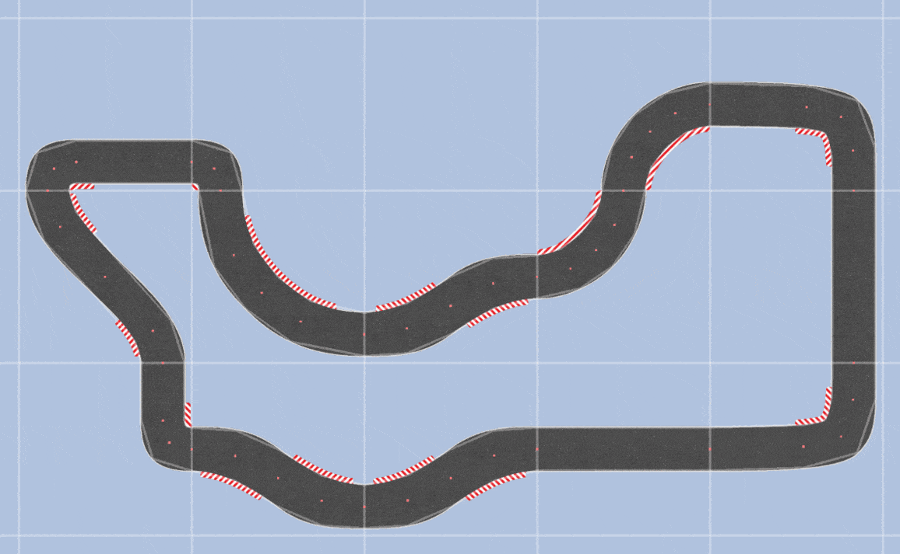

# DeepLearningCars 🏎️
### 2D Autonomous Driving via Neuroevolution

A physics-based 2D car simulation where neural networks learn to drive autonomously through a genetic algorithm. Cars evolve over generations — the best performers survive, reproduce, and mutate — gradually mastering the track without any hand-coded driving logic.

## Demo




---

## How It Works

Each car is controlled by a small neural network with:
- **6 inputs** — distance sensors (raycasts) + current speed
- **2 outputs** — acceleration and steering angle

Cars are scored by how many checkpoints they pass before crashing or timing out. At the end of each generation, the top performers are selected as parents and their weights are mutated to produce the next generation.

```
Generation N
    │
    ▼
[Run simulation] → Cars drive until crash or timeout
    │
    ▼
[Fitness scoring] → Rank by checkpoints passed
    │
    ▼
[Selection] → Keep top 3 performers
    │
    ▼
[Mutation] → Slightly randomize weights
    │
    ▼
Generation N+1
```

---

## Results

The pre-trained agent `x3` was trained for **~170 generations**. In a population of 20 cars, **17 out of 20 (85%) successfully complete the track** — only 3 crash, typically on the sharpest corners.

---

## Setup

```bash
git clone https://github.com/KenKaneki3/deepLearningCars.git
cd DeepLearningCars
pip install -r requirements.txt
py -3.10 __main__.py
```

On startup, a dialog will ask if you want to load a saved agent. Select **Yes** and choose one of the pre-trained saves to watch a trained car drive immediately.

---

## Pre-trained Saves

| Save | Generations | Performance |
|------|-------------|-------------|
| x1   | ~50         | Basic navigation |
| x2   | ~100        | Consistent lap completion |
| x3   | ~375        | 90% survival rate (17/20 cars) |

---

## Configuration

**`config.json`** — simulation settings:
```json
{
    "width": 1280,
    "height": 720,
    "render_timestep": 0.025,
    "timeout_seconds": 30,
    "population": 20,
    "mutation_rate": 0.6
}
```

**`default_nn_config.json`** — neural network settings:
```json
{
    "shape": [6, 4, 3, 2],
    "acceleration": 1,
    "max_speed": 30,
    "rotation_speed": 4
}
```

The `shape` array defines the network architecture — `[6, 4, 3, 2]` means 6 inputs → 4 hidden → 3 hidden → 2 outputs. Don't change the first (6) or last (2) values.

---

## Project Structure

```
DeepLearningCars/
├── __main__.py        # Entry point, simulation setup
├── app.py             # Main simulation loop
├── neural_network.py  # Feedforward NN with sigmoid activation
├── evolution.py       # Genetic algorithm — selection & mutation
├── objects.py         # Car physics, sensor raycasts
├── tiles.py           # Track tile system
├── graphics.py        # Pyglet rendering
├── saves/             # Pre-trained neural network weights (JSON)
│   ├── x1.json
│   ├── x2.json
│   └── x3.json
└── tiles/             # Track tile assets (PNG, SVG, CSV)
```

---

## Tech Stack

- **Pyglet** — 2D simulation and rendering
- **NumPy** — neural network forward pass and weight mutation
- **JSON** — save/load trained agents

No deep learning frameworks used — the neural network and genetic algorithm are implemented from scratch.

---

## License

MIT
